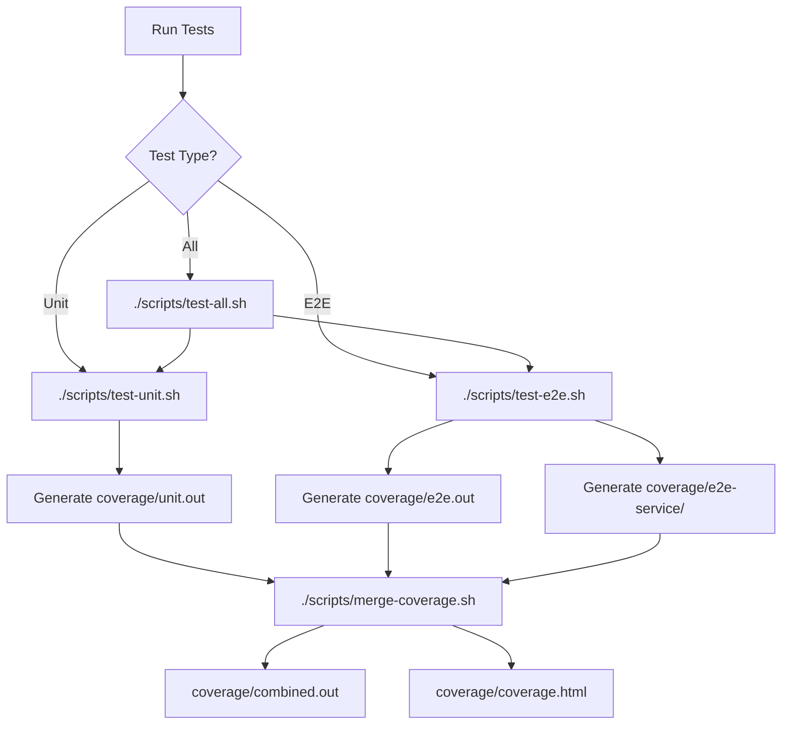

# Testing Guide

This document provides a comprehensive overview of the testing infrastructure, guidelines, and best practices for the heatmap-calendar application.

## Table of Contents

- [Test Architecture Overview](#test-architecture-overview)
- [Unit Tests](#unit-tests)
- [E2E Tests](#e2e-tests)
- [When to Write Unit vs E2E Tests](#when-to-write-unit-vs-e2e-tests)
- [Coverage Guidelines](#coverage-guidelines)
- [Running Tests](#running-tests)
- [CI/CD Integration](#cicd-integration)
- [Best Practices](#best-practices)

## Test Architecture Overview

The heatmap-calendar application uses a multi-layered testing strategy:

```
┌─────────────────────────────────────────────────┐
│              E2E Tests (Integration)            │
│  Test entire application through API + Browser  │
│         Uses: testcontainers, go-rod            │
└─────────────────────────────────────────────────┘
                       ▲
                       │
┌─────────────────────────────────────────────────┐
│            Unit Tests (Isolation)               │
│   Test individual functions and components      │
│          Uses: testify, table-driven            │
└─────────────────────────────────────────────────┘
```

### Architecture Components

#### 1. Unit Tests
- **Location**: Alongside source files (`*_test.go`)
- **Scope**: Individual functions, methods, structs
- **Dependencies**: Mocked or stubbed
- **Execution**: Fast (< 5 minutes for entire suite)
- **Coverage Target**: 70%+ for core business logic

#### 2. E2E Tests
- **Location**: `/e2e/tests/`
- **Scope**: Full application workflows (API → DB → UI)
- **Dependencies**: Real (PostgreSQL via testcontainers, headless browser)
- **Execution**: Slower (5-10 minutes)
- **Coverage Target**: Critical user paths and integration points

#### 3. Test Infrastructure

```
e2e/
├── helpers/          # Reusable test utilities
│   ├── api.go       # HTTP API client
│   ├── browser.go   # Headless browser automation
│   ├── db.go        # Database operations
│   └── assert.go    # Custom assertions
├── testenv/         # Test environment setup
│   ├── env.go       # Environment orchestration
│   ├── postgres.go  # PostgreSQL testcontainer
│   ├── service.go   # Application server management
│   └── instrumented.go  # Coverage-instrumented builds
└── tests/           # Actual E2E test files
    └── smoke_test.go
```

### Test Execution Flow



## Unit Tests

### What to Test with Unit Tests

Unit tests should focus on:

- **Business logic functions** - Calculations, transformations, validations
- **Data structures** - Struct methods, custom types
- **Utility functions** - String manipulation, date handling, formatters
- **Error handling** - Edge cases, invalid input handling
- **Pure functions** - Functions without side effects

### Unit Test Guidelines

#### 1. File Organization

Place unit tests in the same package as the code being tested:

```
handlers/
├── entity_handler.go
├── entity_handler_test.go  ← Unit tests here
├── load_handler.go
└── load_handler_test.go
```

#### 2. Test Function Naming

```go
func TestFunctionName_Scenario_ExpectedBehavior(t *testing.T)
```

Examples:
```go
func TestCalculateCapacity_WithOverride_ReturnsOverrideValue(t *testing.T)
func TestParseDate_InvalidFormat_ReturnsError(t *testing.T)
func TestGroupMembership_EmptyGroup_ReturnsEmptySlice(t *testing.T)
```

#### 3. Table-Driven Tests

Prefer table-driven tests for testing multiple scenarios:

```go
func TestCalculateWorkload(t *testing.T) {
    tests := []struct {
        name     string
        capacity float64
        loads    []Load
        want     float64
        wantErr  bool
    }{
        {
            name:     "no loads",
            capacity: 5.0,
            loads:    []Load{},
            want:     0.0,
            wantErr:  false,
        },
        {
            name:     "single load",
            capacity: 5.0,
            loads:    []Load{{Effort: 2.5}},
            want:     2.5,
            wantErr:  false,
        },
        {
            name:     "exceeds capacity",
            capacity: 5.0,
            loads:    []Load{{Effort: 3.0}, {Effort: 4.0}},
            want:     7.0,
            wantErr:  false,
        },
    }

    for _, tt := range tests {
        t.Run(tt.name, func(t *testing.T) {
            got, err := CalculateWorkload(tt.capacity, tt.loads)

            if tt.wantErr {
                assert.Error(t, err)
                return
            }

            assert.NoError(t, err)
            assert.Equal(t, tt.want, got)
        })
    }
}
```

#### 4. Mocking Dependencies

Use interfaces to enable mocking:

```go
// Production code
type EntityRepository interface {
    GetByID(ctx context.Context, id int) (*Entity, error)
    Save(ctx context.Context, entity *Entity) error
}

// Test code
type MockEntityRepository struct {
    mock.Mock
}

func (m *MockEntityRepository) GetByID(ctx context.Context, id int) (*Entity, error) {
    args := m.Called(ctx, id)
    return args.Get(0).(*Entity), args.Error(1)
}

// In test
func TestService_GetEntity(t *testing.T) {
    mockRepo := new(MockEntityRepository)
    mockRepo.On("GetByID", mock.Anything, 123).Return(&Entity{ID: 123}, nil)

    service := NewService(mockRepo)
    entity, err := service.GetEntity(context.Background(), 123)

    assert.NoError(t, err)
    assert.Equal(t, 123, entity.ID)
    mockRepo.AssertExpectations(t)
}
```

#### 5. What NOT to Unit Test

Avoid unit testing:
- Database queries (use E2E tests)
- HTTP handlers in isolation (use E2E tests)
- Third-party library behavior
- Simple getters/setters
- Generated code (e.g., Swagger docs)

## E2E Tests

### What to Test with E2E Tests

E2E tests should cover:

- **Critical user workflows** - Complete feature flows from UI to database
- **API integration** - Multi-endpoint workflows, authentication
- **Database integration** - CRUD operations, transactions, migrations
- **Browser interactions** - HTMX dynamic updates, form submissions
- **Error scenarios** - Invalid input handling, permission errors

### E2E Test Guidelines

#### 1. Four Allowed Operations

E2E tests can **ONLY** use these operations:

1. **Database Operations** (`db.Query()`, `db.Exec()`)
   - Set up test fixtures
   - Verify database state
   - Clean up test data

2. **API Operations** (`api.Call()`)
   - Test REST endpoints
   - Verify response codes/bodies
   - Test authentication

3. **Browser Operations** (`browser.Navigate()`, `Click()`, `Fill()`, `Text()`)
   - Test UI interactions
   - Verify rendered content
   - Test HTMX updates

4. **Assertions** (`assert.Equal()`, `NoError()`, etc.)
   - Verify expected outcomes
   - Check error conditions

#### 2. Test Structure

Follow the **Arrange-Act-Assert** pattern:

```go
func TestEntityCRUD(t *testing.T) {
    env := testenv.GetTestEnv(t)
    a := helpers.NewAssert(t)
    ctx := context.Background()

    // ARRANGE: Set up test data
    _, err := env.DB.Exec(ctx,
        "INSERT INTO entities (email, name, type, capacity) VALUES ($1, $2, $3, $4)",
        "test@example.com", "Test User", "person", 5.0,
    )
    a.NoError(err)

    // ACT: Perform the operation
    resp, err := env.API.Call("GET", "/api/entities", nil)
    a.NoError(err)

    // ASSERT: Verify the result
    a.Equal(200, resp.StatusCode)
    a.Contains(resp.String(), "Test User")

    // Verify database state
    var count int
    err = env.DB.QueryRow(ctx, "SELECT COUNT(*) FROM entities").Scan(&count)
    a.NoError(err)
    a.Equal(1, count)
}
```

#### 3. Test Isolation

Each test should be independent:

```go
func TestEntityCreation(t *testing.T) {
    env := testenv.GetTestEnv(t)
    a := helpers.NewAssert(t)
    ctx := context.Background()

    // Clean state before test
    _, err := env.DB.Exec(ctx, "DELETE FROM entities WHERE email LIKE 'test%'")
    a.NoError(err)

    // Test code here...

    // Optional: Clean up after test
    defer func() {
        env.DB.Exec(ctx, "DELETE FROM entities WHERE email LIKE 'test%'")
    }()
}
```

#### 4. Browser Testing

Use browser operations for UI-critical workflows:

```go
func TestLoginFlow(t *testing.T) {
    env := testenv.GetTestEnv(t)
    a := helpers.NewAssert(t)
    ctx := context.Background()

    // Start browser
    err := env.StartBrowser()
    a.NoError(err)

    // Navigate to login page
    err = env.Browser.Navigate(env.ServerURL + "/login")
    a.NoError(err)

    // Fill form
    err = env.Browser.Fill("input[name='email']", "test@example.com")
    a.NoError(err)

    err = env.Browser.Fill("input[name='password']", "password123")
    a.NoError(err)

    // Submit
    err = env.Browser.Click("button[type='submit']")
    a.NoError(err)

    // Wait for redirect
    err = env.Browser.Wait(".dashboard")
    a.NoError(err)

    // Verify success
    text, err := env.Browser.Text(".welcome-message")
    a.NoError(err)
    a.Contains(text, "Welcome")
}
```

### E2E Test Best Practices

1. **Minimize browser tests** - Browser automation is slow; prefer API tests
2. **Use meaningful test data** - Make debugging easier with descriptive names
3. **Test happy paths and critical errors** - Don't test every edge case
4. **Keep tests independent** - No shared state between tests
5. **Use timeouts** - Prevent hanging tests with reasonable timeouts

## When to Write Unit vs E2E Tests

### Decision Matrix

| Scenario | Test Type | Rationale |
|----------|-----------|-----------|
| Pure calculation function | **Unit** | No external dependencies |
| Date/time formatting | **Unit** | Simple logic, fast to test |
| Validation logic | **Unit** | Independent of infrastructure |
| Database query | **E2E** | Requires real database |
| HTTP handler | **E2E** | Tests routing + middleware + DB |
| Multi-step workflow | **E2E** | Tests integration points |
| UI interaction | **E2E** | Requires browser rendering |
| Authentication flow | **E2E** | Involves session, DB, redirects |
| Error formatting | **Unit** | Pure string manipulation |
| Cache behavior | **E2E** | Tests real cache integration |

### General Guidelines

**Write Unit Tests when:**
- Testing isolated business logic
- No external dependencies required
- Fast feedback is critical
- Testing many edge cases
- Code can be easily mocked

**Write E2E Tests when:**
- Testing integration between components
- Verifying database behavior
- Testing API contracts
- Validating UI interactions
- Testing authentication/authorization
- Verifying complete user workflows

## Coverage Guidelines

### Coverage Targets

| Test Type | Target | Priority |
|-----------|--------|----------|
| **Combined Coverage** | **80%+** | Required for CI pass |
| **Unit Coverage** | **70%+** | Core business logic |
| **E2E Coverage** | **Critical paths** | User-facing features |

### What to Prioritize

**High Priority (Must Cover):**
- Business logic functions
- Data transformations
- Validation logic
- API endpoints
- Critical user workflows
- Error handling paths

**Medium Priority (Should Cover):**
- Helper utilities
- Formatting functions
- Configuration parsing
- Database queries
- UI components

**Low Priority (Optional):**
- Generated code
- Third-party wrappers
- Simple getters/setters
- Constant definitions

### Coverage Exclusions

Exclude from coverage requirements:
```go
// Code in these paths is not counted toward coverage
/docs/           # Generated Swagger documentation
/vendor/         # Third-party dependencies
/migrations/     # Database migration files
*_generated.go   # Auto-generated code
```

### Measuring Coverage

```bash
# Run all tests with coverage
./scripts/test-all.sh

# Merge coverage reports
./scripts/merge-coverage.sh

# View overall coverage
go tool cover -func=coverage/combined.out | tail -1

# View coverage by package
go tool cover -func=coverage/combined.out

# Open HTML coverage report
open coverage/coverage.html

# Find uncovered code
go tool cover -html=coverage/combined.out
```

### Coverage in CI

GitHub Actions CI automatically:
- Runs unit and E2E tests in parallel
- Merges coverage from all sources
- Posts coverage report on PRs
- Fails if coverage drops below target
- Archives coverage reports for 30 days

## Running Tests

### Quick Reference

```bash
# Unit tests only (fast)
./scripts/test-unit.sh

# E2E tests only (requires Docker)
./scripts/test-e2e.sh

# All tests in parallel
./scripts/test-all.sh

# With verbose output
VERBOSE=1 ./scripts/test-all.sh

# With race detector
RACE=1 ./scripts/test-all.sh

# Specific test pattern
./scripts/test-e2e.sh TestSmoke

# Generate coverage report
./scripts/test-all.sh
./scripts/merge-coverage.sh
open coverage/coverage.html
```

### Using Make

```bash
# Root Makefile
make test          # Run unit tests
make build         # Build application
make lint          # Run linter

# E2E Makefile
cd e2e
make test-e2e              # All E2E tests
make test-e2e-verbose      # Verbose with 10m timeout
make test-smoke            # Smoke test only
make test-race             # With race detector

# Scripts Makefile
cd scripts
make test-all      # All tests in parallel
make test-unit     # Unit tests only
make test-e2e      # E2E tests only
```

### Environment Variables

| Variable | Description | Default |
|----------|-------------|---------|
| `VERBOSE` | Enable verbose test output | `0` |
| `RACE` | Enable race detector | `0` |
| `TIMEOUT` | Test timeout duration | `5m` (unit), `10m` (E2E) |
| `SKIP_E2E` | Skip E2E tests in test-all | `0` |
| `TEST_DATABASE_URL` | PostgreSQL connection string | Auto-generated |
| `TEST_API_KEY` | API key for tests | `test-api-key` |
| `E2E_START_BROWSER` | Enable browser tests | `false` |

## CI/CD Integration

### GitHub Actions Workflow

The CI pipeline (`.github/workflows/ci.yml`) runs on:
- Every push to `main`, `develop`, `claude/**` branches
- Every pull request to `main` or `develop`

### CI Jobs

```
┌──────────┐
│   Lint   │  Run golangci-lint
└──────────┘

┌──────────────┐
│  Unit Tests  │  Run unit tests → Upload coverage/unit.out
└──────────────┘

┌──────────────┐
│  E2E Tests   │  Run E2E tests → Upload coverage/e2e.out + e2e-service/
└──────────────┘

┌──────────────┐
│   Coverage   │  Merge coverage → Post PR comment → Upload combined report
└──────────────┘

┌──────────────┐
│    Build     │  Build binary → Upload artifact
└──────────────┘
```

### CI Features

- **Parallel execution** - Unit and E2E tests run simultaneously
- **PostgreSQL service** - Managed PostgreSQL container for E2E tests
- **Coverage reporting** - Automatic PR comments with coverage summary
- **Artifact uploads** - Coverage reports and binaries stored for 7-30 days
- **Status checks** - Required to pass before merge

### Viewing CI Results

**In Pull Requests:**
- Coverage report posted as PR comment
- Shows total coverage percentage
- Lists lowest coverage packages
- Links to detailed HTML report

**In Workflow Summary:**
- Coverage breakdown by package
- Test execution logs
- Downloadable artifacts

## Best Practices

### General Testing Principles

1. **Test behavior, not implementation** - Focus on what code does, not how
2. **Write tests first for bugs** - Reproduce bug in test, then fix
3. **Keep tests simple** - Tests should be easier to understand than code
4. **Avoid test interdependence** - Each test should run in isolation
5. **Use descriptive names** - Test names should explain what's being tested

### Code Organization

```go
// Good: Clear test structure
func TestCalculateWorkload_MultipleLoads_SumsEffort(t *testing.T) {
    // Arrange
    loads := []Load{
        {Effort: 2.5},
        {Effort: 3.0},
    }

    // Act
    total := CalculateWorkload(loads)

    // Assert
    assert.Equal(t, 5.5, total)
}

// Bad: Unclear test purpose
func TestWorkload(t *testing.T) {
    loads := []Load{{Effort: 2.5}, {Effort: 3.0}}
    total := CalculateWorkload(loads)
    if total != 5.5 {
        t.Error("wrong")
    }
}
```

### Performance Considerations

1. **Parallelize independent tests**
   ```go
   func TestSomething(t *testing.T) {
       t.Parallel() // Runs concurrently with other parallel tests
       // Test code...
   }
   ```

2. **Use test fixtures wisely** - Share expensive setup when safe
3. **Avoid unnecessary sleeps** - Use proper synchronization instead
4. **Clean up resources** - Always close connections, files, containers

### Debugging Failed Tests

```bash
# Run single test with verbose output
go test -v ./path/to/package -run TestSpecificTest

# Run with race detector
go test -race ./...

# Run with coverage to see what's executed
go test -cover -coverprofile=coverage.out ./...
go tool cover -html=coverage.out

# Run E2E tests with verbose logging
VERBOSE=1 ./scripts/test-e2e.sh TestSmoke

# Check test logs in CI
# GitHub Actions → Failed workflow → Job → Expand test step
```

### Maintaining Test Quality

1. **Review test coverage regularly** - Check `coverage/coverage.html`
2. **Fix flaky tests immediately** - Don't ignore intermittent failures
3. **Update tests with code changes** - Keep tests in sync with implementation
4. **Delete obsolete tests** - Remove tests for deleted features
5. **Refactor test helpers** - Extract common patterns to `/e2e/helpers/`

## Additional Resources

- **E2E Testing Guide**: `/e2e/README.md` - Detailed E2E test documentation
- **API Documentation**: `/docs/swagger.yaml` - REST API reference
- **Test Scripts**: `/scripts/` - Test automation scripts
- **GitHub Actions**: `.github/workflows/ci.yml` - CI configuration

---

**Questions or Issues?**

1. Check test logs with `VERBOSE=1`
2. Review `/e2e/README.md` troubleshooting section
3. Check CI logs in GitHub Actions
4. Review existing test examples in `/e2e/tests/`
